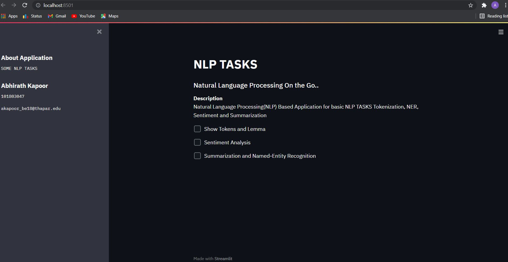
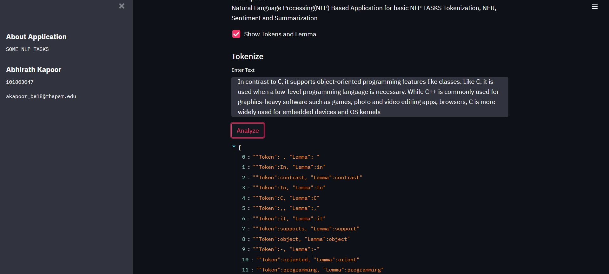
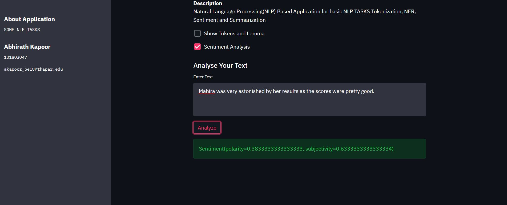
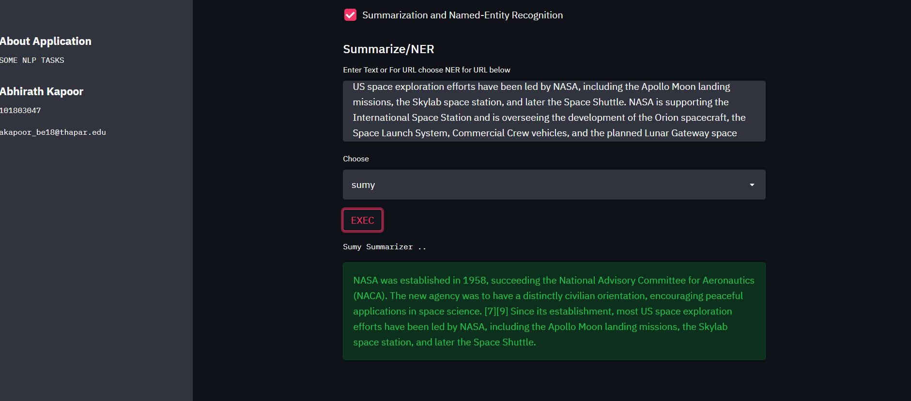
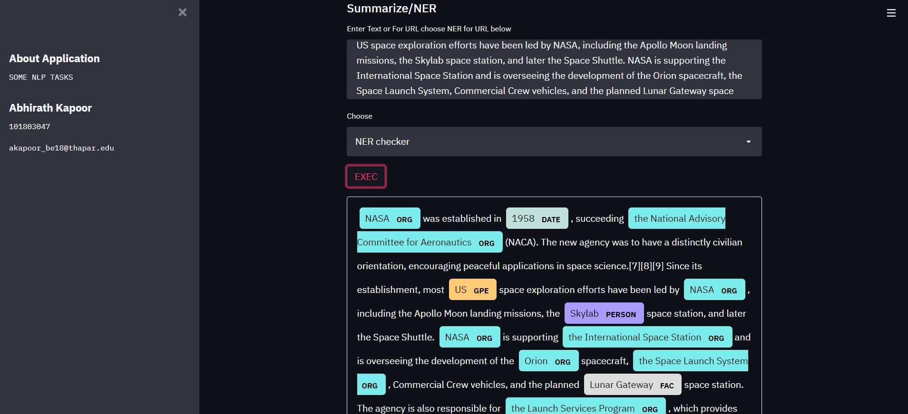

# Natural-Language-Processing-TASKS
Includes Tokenisation, Sentiment Analysis, Named Entity Recognition and Summarization  

#### Description
+ A NLP app built with streamlit framework using SpaCy for Named Entity Extraction(NER) and tokenization, TextBlob for sentiment analysis and  Sumy for text summarization

#### To Run the App
```bash
streamlit run NLP_TASKS_APP.py
```

#### NLP App



#### Tokenization


#### Entity Extraction with Spacy


#### Sentiment Analysis


#### Text Summarization with Sumy



#### By
+ Abhirath Kapoor
+ akapoor_be18@thapar.edu
